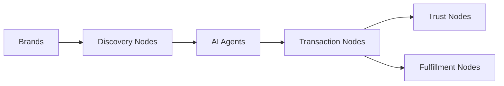

Today, we're introducing the Commerce Mesh Protocol (CMP) - an open, decentralized protocol that fundamentally reimagines how digital commerce works. Instead of walled gardens and platform lock-in, we're building the coordination layer for AI-native commerce.

<!-- truncate -->

## The Problem We're Solving

Digital commerce is broken. Not for lack of innovation, but from too much centralization:

- **Amazon controls 40% of US e-commerce**, extracting an average of 45% from each sale
- **Platform fees have increased 34% since 2015**, crushing merchant margins
- **AI agents can't effectively shop** across fragmented, API-limited platforms
- **Brands have zero customer relationships** on major marketplaces

As we enter the age of agentic commerce - where AI assistants make purchasing decisions - these limitations become catastrophic.

## Introducing the Commerce Mesh Protocol

CMP is an open protocol that separates commerce into four modular, interoperable primitives:

### 🔍 Discovery Nodes
Universal product search across the entire mesh, not trapped in platform silos. Brands publish standardized feeds that any AI agent can discover and query.

### 💳 Transaction Nodes  
Open payment processing with true competition. Multiple providers compete for each transaction, driving down fees and spurring innovation.

### 🛡️ Trust Nodes
Portable reputation that follows sellers everywhere. No more starting from zero on each new platform.

### 📦 Fulfillment Nodes
Distributed logistics coordination. Optimize for speed, cost, or sustainability based on buyer preferences.

## How It Works

Instead of monolithic platforms, CMP enables a mesh of specialized nodes:



1. **Brands** publish product feeds at `/.well-known/cmp/feed.json`
2. **Discovery Nodes** index and serve product data  
3. **AI Agents** query multiple nodes to find the best options
4. **Transactions** route through competing payment processors
5. **Trust** signals aggregate across the entire network
6. **Fulfillment** coordinates across carriers and 3PLs

## What We're Launching Today

### Discovery Node v0.1
- Open source implementation in Python/FastAPI
- Production-ready for catalogs up to 1M products  
- Reference integrations for Shopify and WooCommerce
- Complete [documentation](/docs/intro) and [specifications](/docs/feeds/specification)

### Brand Registry
- Decentralized directory of participating brands
- Simple JSON-based registration process
- Community-governed approval process
- [Register your brand](/docs/registry/overview) today

### Developer Tools
- Python, JavaScript, and Go SDKs
- Feed generation libraries
- Validation tools
- Testing framework

## For Developers

Get started in minutes:

```bash
# Clone the Discovery Node
git clone https://github.com/commercemesh/discovery-node
cd discovery-node

# Install dependencies
pip install -r requirements.txt

# Run with sample data
python -m cmp.discovery --sample-data

# API is now available at http://localhost:8000
```

Query products across the mesh:

```python
from cmp_sdk import DiscoveryClient

client = DiscoveryClient()
results = client.search(
    query="wireless headphones",
    max_price=200,
    attributes={"noise_cancelling": True}
)

for product in results:
    print(f"{product.name} - ${product.price}")
```

## For Brands

Publishing your catalog is straightforward:

1. **Generate your feed** using our tools or manually
2. **Host at** `https://yourdomain.com/.well-known/cmp/feed.json`
3. **Register** in the Brand Registry
4. **You're live** - AI agents can now discover your products

No platform fees. No gatekeepers. Direct connection to AI-powered buyers.

## The Path Forward

This is just the beginning. Our 2025 roadmap includes:

### Q1 2025: Foundation
- ✅ Discovery Node v0.1 (Today!)
- Transaction Node Alpha
- Trust reputation aggregation
- 100+ brands registered

### Q2 2025: Scale
- Production Transaction Nodes
- Fulfillment coordination
- Fraud prevention systems
- 1,000+ brands

### Q3 2025: Intelligence
- AI-optimized query language
- Predictive inventory routing
- Dynamic trust scoring
- 10,000+ brands

### Q4 2025: Ecosystem
- Mobile SDKs
- Marketplace adapters
- Analytics platform
- 50,000+ brands

## Why This Matters

We're not building another e-commerce platform. We're creating the protocol layer that makes platforms obsolete.

When commerce runs on open protocols:
- **Brands** keep their margins and customer relationships
- **Developers** build without platform restrictions  
- **AI agents** access all inventory, not just walled gardens
- **Innovation** happens at the edge, not the center

## Join the Revolution

The Commerce Mesh Protocol is live. The code is open source. The community is forming.

### For Builders
- ⭐ Star our [GitHub repo](https://github.com/commercemesh/commercemesh)
- 💬 Join our [Discord](https://discord.com/channels/1381756773563633786h)
- 📚 Read the [documentation](/docs/intro)
- 🚀 Deploy your first node

### For Brands  
- 📝 [Register your brand](/docs/registry/registration)
- 📊 Publish your feed
- 🤝 Connect with the community
- 💰 Start selling without platform fees

### For Visionaries
- 📖 Read our [technical architecture](/docs/architecture/overview)
- 💭 Share your ideas
- 🛠️ Contribute to the protocol
- 🌍 Help us reshape commerce

## The Future is Open

The internet succeeded because HTTP was open. Email thrived because SMTP was decentralized. Commerce deserves the same foundation.

Today, we take the first step toward truly open commerce. No gatekeepers. No rent-seekers. Just protocols, possibilities, and permissionless innovation.

Welcome to the Commerce Mesh Protocol. Let's build the future of commerce together.

---

*Ready to dive deeper? Check out our [comprehensive blog post](/blog/commerce-mesh-protocol-explained) explaining the full vision and technical architecture of CMP.*