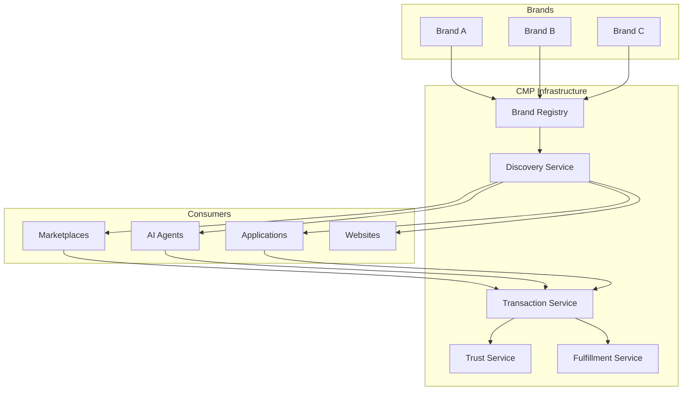

# Architecture Overview

Commerce Mesh Protocol (CMP) is designed as a decentralized, open protocol for commerce infrastructure. This document provides an overview of the technical architecture and design principles.

## Core Design Principles

### 1. Protocol, Not Platform
- Open standards over proprietary systems
- Interoperability by design
- No vendor lock-in
- Community-driven evolution

### 2. Decentralized Architecture
- No central authority
- Direct brand-to-consumer connections
- Distributed trust model
- Resilient infrastructure

### 3. Semantic Data Model
- JSON-LD for self-describing data
- Schema.org vocabulary
- Machine-readable semantics
- AI-agent friendly

### 4. Four Core Primitives
- **Discover** - Find products and services
- **Transact** - Execute commerce transactions
- **Trust** - Establish and verify reputation
- **Fulfillment** - Route and track orders

## System Architecture



## Component Overview

### Brand Registry
- Decentralized brand directory
- JSON-LD formatted entries
- Git-based versioning
- Community governance

### Discovery Service
- Product search and filtering
- Feed aggregation
- Real-time indexing
- Semantic search capabilities

### Transaction Service
- Order processing
- Payment orchestration
- State management
- Event streaming

### Trust Service
- Reputation scoring
- Review aggregation
- Verification services
- Dispute resolution

### Fulfillment Service
- Order routing
- Inventory management
- Shipping integration
- Tracking updates

## Data Flow

### 1. Registration Flow
```
Brand → Create Entry → Submit PR → Review → Merge → Registry Update
```

### 2. Discovery Flow
```
Agent → Query API → Search Index → Fetch Feeds → Return Results
```

### 3. Transaction Flow
```
Customer → Create Order → Validate → Process Payment → Confirm → Fulfill
```

### 4. Update Flow
```
Brand → Update Feed → Webhook Trigger → Index Update → Cache Invalidation
```

## Technology Stack

### Data Formats
- **JSON-LD** - Linked data representation
- **Schema.org** - Vocabulary standard
- **OpenAPI** - API specifications
- **Webhooks** - Event notifications

### Protocols
- **HTTPS** - Secure communication
- **REST** - API architecture
- **WebSockets** - Real-time updates
- **OAuth 2.0** - Authentication

### Standards
- **ISO 4217** - Currency codes
- **ISO 8601** - Date/time format
- **UN/CEFACT** - Unit codes
- **RFC 3986** - URI specification

## Scalability Design

### Horizontal Scaling
- Stateless services
- Load balancing
- Geographic distribution
- Edge caching

### Data Sharding
- Deterministic SKU-based sharding
- Parallel processing
- Even distribution
- Predictable routing

### Caching Strategy
- CDN for static feeds
- Redis for hot data
- ETags for efficiency
- Smart invalidation

## Security Architecture

### Data Security
- HTTPS everywhere
- Data encryption at rest
- Secure key management
- Regular security audits

### Authentication
- API key authentication
- OAuth 2.0 support
- JWT tokens
- Rate limiting

### Trust Mechanisms
- HMAC webhook signatures
- Certificate pinning
- Domain verification
- Fraud detection

## Integration Patterns

### Direct Integration
Brands host their own infrastructure:
```
Brand Server → Product Feed → CMP Discovery → Consumer
```

### Proxy Integration
Third-party hosting for smaller brands:
```
Brand → Proxy Service → Product Feed → CMP Discovery → Consumer
```

### Marketplace Integration
Existing marketplaces as CMP nodes:
```
Marketplace → Adapter → CMP Format → Discovery → Consumer
```

## Future Architecture

### Planned Enhancements
- GraphQL API support
- Blockchain integration
- IPFS content addressing
- Advanced ML/AI features

### Extensibility
- Plugin architecture
- Custom primitives
- Protocol extensions
- Community modules

## Next Steps

- [Technical Specifications](/docs/architecture/specifications) - Detailed specs
- [API Architecture](/docs/architecture/api) - API design patterns
- [Security Model](/docs/architecture/security) - Security details
- [Performance Guide](/docs/architecture/performance) - Optimization tips